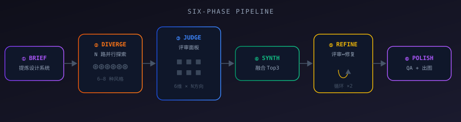
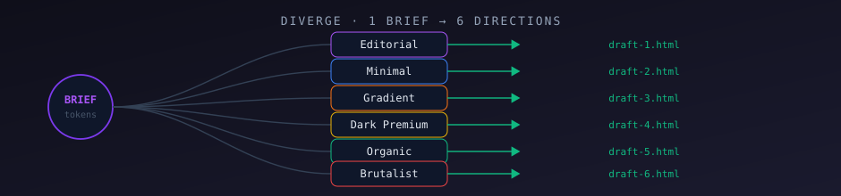
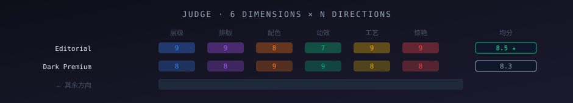
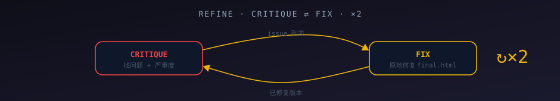

<div align="center">

<picture>
  <source media="(prefers-color-scheme: dark)" srcset="docs/images/logo/logo-dark.svg?v=2">
  <source media="(prefers-color-scheme: light)" srcset="docs/images/logo/logo-light.svg?v=2">
  
</picture>

# fireworks-design

**An open-source Claude Code workflow that replicates ClaudeDesign — fan out many distinct design directions, judge them like a panel, synthesize the best, and adversarially refine to a single world-class frontend page.**

[English](./README.md) · [简体中文](./README.zh-CN.md)

[](./LICENSE)
[](https://claude.com/claude-code)
[](https://claude.com/claude-code)
[](#--model-choices)
[](./CONTRIBUTING.md)

</div>

---

> **One-sentence pitch:** Stop rolling the dice on a single model output. `fireworks-design` explores 6–8 independent aesthetics in parallel, scores each across 6 design dimensions, grafts the winners together, then critique-fix-loops the result until it's shippable.



## ✨ Why this exists

Even experienced designers ration exploration — there's rarely time to prototype a dozen directions, so you settle for two. From the [Claude Design announcement](https://www.anthropic.com/news/claude-design-anthropic-labs):

> *"Even experienced designers have to ration exploration — there's rarely time to prototype a dozen directions, so you limit yourself to a few."*

A single LLM generation is **one draw from a distribution**. Its taste, mood, and prompt interpretation are locked into that one version. `fireworks-design` turns that variance into a **quality floor** by:

- **Exploring widely** — N parallel agents, each committed to a distinct aesthetic.
- **Judging independently** — a panel scores every direction across separate design dimensions.
- **Synthesizing** — taking the winner as the skeleton and grafting the best of the runners-up.
- **Refining adversarially** — critique → fix, looped until it clears the bar.

## 🧠 How it works — six phases

### ① Brief — distill a design system
One agent turns your `prompt` (+ optional `brand`) into a shared creative brief: product framing, audience, required sections, and concrete **design tokens** (font pairings, palette hexes, mood, references). These tokens are injected into every subsequent agent, so the whole pipeline stays on-brand.

### ② Diverge — wide exploration *(the quality core)*
Each agent commits fully to one aesthetic and produces a complete, self-contained HTML file. Each generator internally **plans → self-critiques → produces**, rather than dumping a first draft.



### ③ Judge — panel scoring
Every direction × every design dimension, scored 1–10 by independent critics (~36 critiques in parallel for 6 directions). Each verdict also returns its **single highest-leverage fix**, which feeds the next phase.



### ④ Synthesize — graft the best
Reads the Top-3 directions' source, uses the strongest as the base, folds in the best elements of the others, and fixes every issue the judges flagged. The output must clearly beat any single direction.

### ⑤ Refine — adversarial polishing
A ruthless reviewer returns prioritized issues (severity-tagged); a fixer applies them surgically. Looped `refineRounds` times (default 2). This is ClaudeDesign's "fine-grained controls," engineered.



### ⑥ Polish — ship-ready QA
A final gate checks and fixes: responsiveness (375/768/1280+), all interactive states, `prefers-reduced-motion`, semantic HTML + ARIA, WCAG AA contrast, no console errors, no leftover placeholders — then writes `final.html`.

## 📦 Install

`fireworks-design` is a single-file **Claude Code Workflow**. Drop it into your project's workflows folder:

```bash
# from your project root (the dir you run `claude` in)
mkdir -p .claude/workflows
curl -fsSL -o .claude/workflows/fireworks-design.js \
  https://raw.githubusercontent.com/yizhiyanhua-ai/fireworks-design/main/fireworks-design.js
```

Or clone and copy:

```bash
git clone https://github.com/yizhiyanhua-ai/fireworks-design.git
cp fireworks-design/fireworks-design.js .claude/workflows/
```

That's it. It becomes a **named workflow** — invoke it from any Claude Code session with the `Workflow` tool.

## 🚀 Usage

Call it from Claude Code (the workflow runs in the background; watch live progress with `/workflows`):

```
Workflow({
  name: "fireworks-design",
  args: {
    prompt: "Landing page for an AI note app — privacy-first, instant retrieval, aimed at indie developers",
    outputDir: "/abs/path/to/output",   // REQUIRED: absolute path
    variants: 6,        // directions to explore (default 6, max 8)
    refineRounds: 2,    // critique→fix loops (default 2)
    brand: "optional: accent #7c3aed, font Inter"  // optional
  }
})
```

**Output:**
- `<outputDir>/final.html` — the finished page
- `<outputDir>/draft-*.html` — every explored direction (use them on their own)
- Returns: winning lens, full ranking, all direction paths, polish summary

## 💼 Example cases

> 📖 **Real generated outputs** (not hypothetical) live in [`examples/`](./examples/README.md) — 14 full pages produced by actual workflow runs, with the winner, agent/token cost, and what each pipeline stage fixed.

### Case 1 — SaaS landing page
```
prompt: "Pricing + landing page for 'Vector', an open-source vector DB. Developer audience,
         emphasize speed benchmarks, a code block hero, and a clean comparison table."
variants: 6, refineRounds: 2
```
Expect a magnetic hero with a real code snippet, a benchmark stat strip, and a polished 3-tier pricing block — cross-checked for responsive behavior and contrast.

### Case 2 — Open-source project homepage
```
prompt: "Homepage for an MIT-licensed CLI tool called 'tideline'. Tone: hacker, precise, fast.
         Include install command, 3 feature cards, and a terminal-style demo."
brand: "mono-leaning, accent #10b981, dark hero"
variants: 4, refineRounds: 2
```
A developer-grade page with a copy-to-clipboard install line, monospace accents, and a fake-terminal animation that respects `prefers-reduced-motion`.

### Case 3 — Personal portfolio
```
prompt: "Portfolio one-pager for a product designer. Asymmetric editorial layout,
         large type, a selected-works grid, and a contact CTA."
variants: 8, refineRounds: 3
```
Maximum exploration — eight directions (Editorial, Swiss Minimal, Dark Premium, Brutalist…) judged and merged; three refine rounds for type polish.

### Case 4 — Marketing one-pager
```
prompt: "Event landing page for a one-day AI conference. Bold countdown hero,
         speaker grid, schedule timeline, and a registration CTA."
brand: "brand color #ea580c"
variants: 6, refineRounds: 2
```

<details>
<summary><b>More quick recipes</b></summary>

| Goal | Suggested args |
|------|----------------|
| Fast first draft | `variants: 4, refineRounds: 1` |
| Maximum quality | `variants: 8, refineRounds: 3` |
| Brand-locked | pass `brand:` with hexes + fonts |
| Specific aesthetics only | `lenses: ["editorial","dark-premium"]` |

</details>

## ✨ Featured outputs (效果解读)

14 real pages across totally different domains — [**all live on GitHub Pages**](https://yizhiyanhua-ai.github.io/fireworks-design/) · [full table + deep-dives](./examples/README.md). Four highlights:

| | Page | Winner & why it fits | Signature moment |
|---|------|---------------------|------------------|
| 🎬 | [**LUMIÈRE**](https://yizhiyanhua-ai.github.io/fireworks-design/examples/movie-rating-platform/final.html) — movie rating | **Dark Premium** — theatrical immersion beat editorial; antique-gold rationed as "prestige currency" (only ratings/CTA/top ranks) | one-shot gold projector-beam sweeps the 9.2 score |
| 🎵 | [**NOVA · AURORA**](https://yizhiyanhua-ai.github.io/fireworks-design/examples/music-album/final.html) — album | **Bold Editorial** — oversized Didone wordmark, midnight-violet-teal 60/30/10 | generative cover + 32-bar visualizer + play-state changes the whole room |
| 🎨 | [**OBJECT & ECHO**](https://yizhiyanhua-ai.github.io/fireworks-design/examples/creative-agency/final.html) — studio | **Bold Editorial** — gallery-zine, kinetic grotesque "object" vs ghosted italic "echo" | spatial afterimage echo behind the hero wordmark |
| ✈️ | [**AZORES**](https://yizhiyanhua-ai.github.io/fireworks-design/examples/travel-destination/final.html) — travel | **Bold Editorial** — photography-as-product, NatGeo-meets-Cereal | interactive islands map with breathing halo + cross-fade detail panel |

> **Winner diversity proves the point:** across 14 briefs, Bold Editorial won ×8, Dark Premium ×3 (movie/restaurant/ecommerce), Swiss Minimal ×2 (fitness/edtech), Editorial ×1 (nonprofit). Different briefs crown different winners — that's why we judge instead of generating once. Read the full **效果解读** (winning rationale, signature moments, real bugs the refine/polish pass caught) in [`examples/README.md`](./examples/README.md#-featured--效果解读-effect-deep-dives).

## ⚙️ Arguments

| Argument | Required | Default | Description |
|----------|:--------:|:-------:|-------------|
| `prompt` | ✅ | — | What to build (natural language). |
| `outputDir` | ✅ | — | Absolute path to write files. |
| `variants` | ❌ | `6` | Number of directions (3–8). |
| `refineRounds` | ❌ | `2` | Critique→fix loops. |
| `brand` | ❌ | — | Brand notes / existing design system / references. |
| `lenses` | ❌ | all | Restrict to specific aesthetics by key. |

## 🎚️ Customization

### Aesthetic lenses (`LENSES`)
The distinct directions explored in phase ②. Edit the `LENSES` array to add your own styles:

| Key | Style |
|-----|-------|
| `editorial` | Bold Editorial — high-contrast, expressive display type, magazine grid |
| `minimal` | Swiss Minimal — grid-obsessed, restrained, Inter/Geist |
| `gradient` | Vibrant Gradient — mesh gradients, glassmorphism, neon accents |
| `dark-premium` | Dark Premium — near-black canvas, gold/violet accent, cinematic |
| `organic` | Soft Organic — rounded forms, warm palette, approachable motion |
| `brutalist` | Neo-Brutalist — raw borders, hard shadows, mono, high-energy |
| `glass` | Glass Aurora — translucent layers, aurora blobs, backdrop blur |
| `mono-tech` | Mono Tech — monospace accents, terminal/data-forward |

### Judge dimensions (`DIMS`)
What the panel scores on: hierarchy · typography · color/contrast · motion · engineering craft · delight/originality.

### 🤖 Model choices
Every `agent()` call **omits the `model` parameter**, so all subagents inherit the **current session model**. Run it on Opus for top quality, on Sonnet for speed, or on any model your harness exposes — no code changes needed.

## 🔗 Mapping to ClaudeDesign

| ClaudeDesign principle | This workflow |
|------------------------|---------------|
| Wide exploration (a dozen directions) | ② Diverge — 6–8 parallel aesthetics |
| Strongest vision model judges | ③ Judge — 6 dimensions × N directions |
| Distill & merge the best | ④ Synthesize — Top-3 graft |
| Fine-grained iterative controls | ⑤ Refine — critique↔fix loop |
| Design system throughout | ① Brief — tokens injected everywhere |
| Export deliverable HTML | ⑥ Polish — QA → `final.html` |

## 💰 Cost & considerations

- 6 variants × full pipeline ≈ **40+ agent calls**. This is deliberate — quality is the point.
- Token cost scales with `variants`, `refineRounds`, and page complexity.
- Workflow agents read full HTML files for judging/synthesis, so very long pages cost more.
- Want budget-aware scaling? Tie `VARIANT_COUNT` to `budget.total` (the workflow exposes `budget`).

## ❓ FAQ

**Do I need a specific model?** No. It inherits your session model. A strong model (Opus-class) gives the best results.

**Can I use just one direction?** Then you don't need this workflow — run a normal frontend-design pass instead. The value is the parallel exploration + judging.

**Where do the draft files go?** In your `outputDir`. They're not committed (see `.gitignore`); keep or delete them freely.

**Can I plug in my design system?** Yes — pass it via `brand`. Brief will fold your tokens into every agent.

## 🤝 Contributing

Contributions welcome — new aesthetic lenses, judge dimensions, or smarter synthesis. Open an issue first to discuss scope. See [CONTRIBUTING.md](./CONTRIBUTING.md).

## 📄 License

[MIT](./LICENSE) © yizhiyanhua-ai

---

<div align="center">

<sub>Built with Claude Code · Quality is the only thing that matters.</sub>

**[📖 简体中文](./README.zh-CN.md)**

</div>
